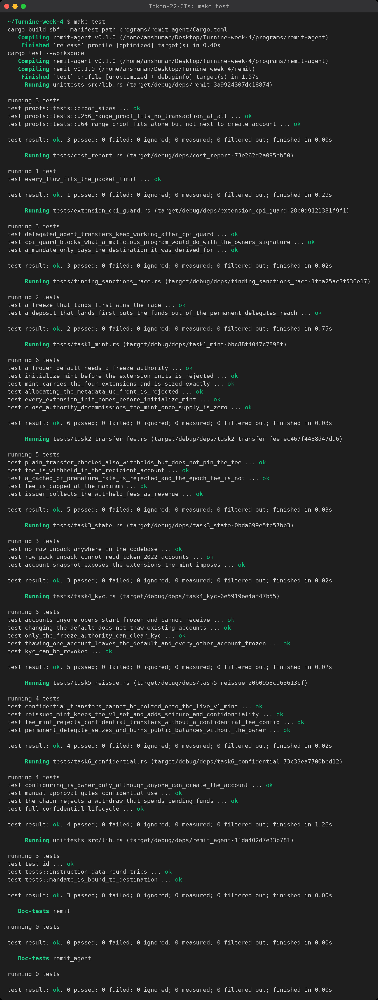

# Token-22-CTs: a Token-2022 remittance stablecoin

Turbin3 week 4 assignment: Token-2022 extensions and confidential transfers.

The repository issues and operates rUSD, a remittance stablecoin with a protocol fee on every transfer, accounts that start frozen until KYC clears, metadata stored in the mint itself, and a close authority for decommissioning. It then re-issues the mint with a seizure authority (`PermanentDelegate`) and confidential transfers, and works out what happens when those two requirements meet.

There are two crates:

- `remit` is a Rust client library that implements tasks 1 to 6 on top of `spl-token-2022-interface`.
- `remit-agent` is a small on-chain program for the extension challenge: it spends an `Approve`d allowance and keeps working after the user turns on CPI Guard.

The tests run the real Token-2022 v11 program, the ATA program and the ZK ElGamal Proof program in-process with LiteSVM, using the mainnet feature set. The whole suite takes about two seconds.



## Running the tests

```sh
make test      # builds the agent with cargo build-sbf, then runs cargo test --workspace
make report    # prints transactions, bytes and compute units per flow
make lint      # rustfmt check + clippy with warnings denied
```

Without make:

```sh
cargo build-sbf --manifest-path programs/remit-agent/Cargo.toml
cargo test --workspace
```

Requirements: Rust 1.89 or newer (tested on 1.95.0) and the Solana CLI for `cargo build-sbf` (tested on 3.1.10, platform-tools v1.52). You do not need a validator or network access. Only `extension_cpi_guard.rs` needs the SBF build; if `target/deploy/remit_agent.so` is missing, those three tests fail with a message saying how to build it.

## Layout

```text
remit/src/
  mint.rs          tasks 1 and 5: extension sets, sizing, instruction ordering, close
  transfer.rs      task 2: transfer_checked_with_fee, epoch-aware fee, fee collection
  state.rs         task 3: the only place account bytes are decoded (StateWithExtensions)
  kyc.rs           task 4: thaw after KYC, freeze on revocation, the separate mint default
  confidential.rs  task 6: configure, approve, deposit, apply, transfer, withdraw
  proofs.rs        getting ZK proofs on-chain inside the 1232-byte packet limit
  compliance.rs    atomic seizure (thaw, permanent-delegate transfer, refreeze)
  cluster.rs       the Cluster trait every flow is written against, tx size helpers
  token.rs         ATA creation, mint_to, approve, enable CPI Guard
remit/tests/       one file per task, the finding, the extension challenge, a cost report
programs/remit-agent/src/lib.rs   the delegate agent program
fixtures/spl_record.so            mainnet spl-record binary (see fixtures/README.md)
```

## Stack

| piece | version |
|---|---|
| LiteSVM | 0.16.0 (Agave 4.2.2 runtime, mainnet feature set sampled 2026-08-24, bundles Token-2022 v11.0.0) |
| spl-token-2022-interface | 3.1.1 |
| spl-token-metadata-interface | 1.0.1 |
| solana-zk-sdk | 7.0.1 |
| spl-token-confidential-transfer-proof-generation | 0.6.1 |
| spl-record | 0.4.0 (instruction builders); the program binary is dumped from mainnet |

Mainnet disabled the ZK ElGamal Proof program in 2025 after a soundness bug and re-enabled it later. Both `disable_zk_elgamal_proof_program` and `reenable_zk_elgamal_proof_program` are active in the feature set LiteSVM uses, so the confidential flows run with the program enabled, as on mainnet today.

The library never talks to LiteSVM directly. Every flow takes a `&mut impl Cluster`, a five-method trait (payer, read account, read epoch, rent, send). The test harness implements it for LiteSVM, and it could be implemented for an RPC client in the same way. The harness refuses any transaction larger than 1232 bytes. LiteSVM itself does not check the packet limit (it accepted a 1470-byte transaction in a quick experiment), so without this check the confidential flows could pass the tests and still fail on devnet.

## Task 1: the mint

| extension | configuration |
|---|---|
| `TransferFeeConfig` | 25 bps, capped at 2.50 rUSD per transfer; fee-config and withdraw-withheld authorities are separate keys |
| `MetadataPointer` | points at the mint itself |
| `DefaultAccountState` | `Frozen` |
| `MintCloseAuthority` | a dedicated close key |
| `TokenMetadata` | name, symbol, URI, plus `issuer`, `peg` and `kyc` fields, stored in the mint account |

Each authority role (mint, freeze/KYC, fee config, fee withdrawal, close, metadata) has its own key, so each one can be rotated or revoked without touching the others.

### Sizing

`InitializeMint` rejects the account unless its length equals exactly `ExtensionType::try_calculate_account_len::<Mint>(&extensions)` for the extensions initialized so far. The mint is therefore allocated for the four fixed-size extensions only: 387 bytes. `TokenMetadata` is variable-length. The token-metadata `Initialize` instruction reallocates the mint after `InitializeMint`, and reallocation brings no lamports with it, so `CreateAccount` funds the account for its final size of 387 + 235 = 622 bytes. The test checks that the final balance is exactly the rent-exempt minimum for the final length.

One detail the tests caught: `TokenMetadata::tlv_size_of()` assumes the generic spl-type-length-value header (8-byte discriminator plus 4-byte length). A Token-2022 extension entry has a 4-byte header (2-byte type plus 2-byte length). Funding with `tlv_size_of()` over-pays rent for 8 bytes that are never allocated. `mint::metadata_tlv_len` computes `4 + packed_len` instead.

### Ordering

Transaction 1 is `CreateAccount`, `InitializeTransferFeeConfig`, `InitializeMetadataPointer`, `InitializeDefaultAccountState`, `InitializeMintCloseAuthority`, then `InitializeMint2`. None of the extension inits takes a signature, so they must land in the same transaction as `CreateAccount`. If they were sent separately, anyone watching could initialize the funded, empty account with their own fee authority and freeze authority first. Transaction 2 is the metadata `Initialize` (signed by the mint authority, so it has to follow `InitializeMint`) and one `UpdateField` per extra field.

Tests (`task1_mint.rs`):

- the on-chain extension list, sizes, lamports and every configured value
- the planned instruction order, decoded with `TokenInstruction::unpack`
- `InitializeMint` placed before the extension inits fails with `InvalidAccountData`
- allocating the metadata space up front makes `InitializeMint` fail with `InvalidAccountData`
- a frozen default without a freeze authority fails with `MintCannotFreeze`
- the close authority can close the mint only when the supply is zero (`MintHasSupply` before, `OwnerMismatch` for anyone else), and the rent is refunded

## Task 2: transfers use `transfer_checked_with_fee` with the epoch fee

```rust
// remit/src/transfer.rs
let mint = load_mint(cluster, &mint_address)?; // decoded with StateWithExtensions
let epoch = cluster.epoch(); // Clock sysvar, read on every call
let fee = expected_fee(&mint, epoch, amount)?; // TransferFeeConfig::calculate_epoch_fee(epoch, amount)
let instruction = transfer_checked_with_fee(
    &TOKEN_2022_PROGRAM_ID, source, &mint_address, destination, &authority.pubkey(), &[],
    amount, mint.decimals, fee,
)?;
```

A `TransferFeeConfig` holds two schedules. `SetTransferFee` writes the new one into `newer_transfer_fee` with `epoch = current + 2`, and until then the program keeps charging `older_transfer_fee`. Both a client that caches "the rate" and a client that reads `newer_transfer_fee` directly get the fee wrong for part of that window. Token-2022 computes the fee itself and rejects the instruction with `FeeMismatch` when the numbers differ. With `TransferCheckedWithFee`, a sender therefore never pays a fee it did not sign for, even if the epoch changes between signing and execution. Plain `TransferChecked` would take whatever the current fee is.

`a_cached_or_premature_rate_is_rejected_and_the_epoch_fee_is_not` walks through this. At epoch 0 the fee authority raises the fee from 25 to 100 bps. In epochs 0 and 1, a transfer that already applies the new schedule (1.00 rUSD on 100 rUSD) fails with `FeeMismatch`, and `transfer_with_fee` charges 0.25. At epoch 2 the cached 0.25 fails with `FeeMismatch`, and `transfer_with_fee` charges 1.00 without any code change.

Fees are the issuer's revenue. They are withheld in the recipient's `TransferFeeAmount`. `collect_fees` harvests them into the mint (anyone may do this) and withdraws them to the treasury account (withdraw-withheld authority only). The treasury is an ordinary holder of this mint, so it has to clear KYC before it can receive.

Other tests: the fee lands in the recipient's withheld amount, the 2.50 cap applies to large transfers, and collection moves exactly the sum of the fees while the supply stays unchanged.

## Task 3: state is read only through `StateWithExtensions`

`state.rs` is the one module that decodes mint or token-account bytes, and it only calls `StateWithExtensions::<Mint>::unpack` and `StateWithExtensions::<Account>::unpack`. The resulting snapshots carry the base fields and every extension the project uses, including the variable-length `TokenMetadata`. The on-chain agent program reads the mint the same way.

`Pack::unpack` cannot work here. It requires `len == 82` for a mint and `len == 165` for an account, so it rejects every account with an extension (`InvalidAccountData`). Even when the length happens to fit, it ignores the TLV area where the fee, the frozen default, the permanent delegate and the encrypted balances live. `task3_state.rs` shows both calls failing on real accounts as a negative control, and includes a lint test that scans the library and program sources and fails if any code line uses `Pack`, `Mint::unpack`, `Account::unpack`, `unpack_unchecked` or `unpack_from_slice`.

## Task 4: the KYC unfreeze path

`DefaultAccountState(Frozen)` makes every new account start frozen, including the ATAs anyone can create for anyone. A frozen account cannot receive, even through `MintTo`. `kyc::approve_kyc` is a single `ThawAccount` signed by the freeze authority, and it only touches the one account. The mint-level default (`UpdateDefaultAccountState`) is a different control, and the KYC path never calls it.

Tests (`task4_kyc.rs`):

- an account opened by a third party starts frozen and `MintTo` fails with `AccountFrozen`
- the owner, a stranger and the mint authority all get `OwnerMismatch` when they try to thaw; only the freeze authority succeeds
- thawing Alice leaves Bob frozen, leaves the mint default at `Frozen`, and Carol's account opened afterwards still starts frozen
- changing the mint default to `Initialized` does not thaw any existing account; it only affects accounts created afterwards
- revoking KYC (freezing again) blocks transfers and keeps the balance in place

## Task 5: the re-issue

Confidential transfers cannot be added to a live mint. Sending the confidential-transfer `InitializeMint` instruction to the v1 mint fails with `AlreadyInUse`, because extension inits only run before `InitializeMint`. The v2 mint is therefore a new mint whose extension list is the v1 list followed by three additions:

| | v1 | v2 |
|---|---|---|
| `TransferFeeConfig` | yes | yes |
| `MetadataPointer` (to itself) | yes | yes |
| `DefaultAccountState(Frozen)` | yes | yes |
| `MintCloseAuthority` | yes | yes |
| `PermanentDelegate` | | the seizure authority |
| `ConfidentialTransferMint` | | `auto_approve_new_accounts = false` (manual approval), auditor ElGamal key |
| `ConfidentialTransferFeeConfig` | | withdraw-withheld ElGamal key |
| allocated / final size | 387 / 622 bytes | 625 / 860 bytes |

The gap between "the same extensions plus confidentiality" and a mint that actually initializes is `ConfidentialTransferFeeConfig`. Token-2022 rejects `TransferFeeConfig` + `ConfidentialTransferMint` without it (`InvalidExtensionCombination`, tested), because the fee on an encrypted amount must itself be encrypted, under a key the issuer controls. The gap carries on to the account side. Every holder has to `Reallocate` room for `ConfidentialTransferAccount` and `ConfidentialTransferFeeAmount`, configure the account with their own keys, and wait for the issuer's approval. Existing v1 holders have to move to the new mint.

The larger gap is between the two new powers themselves: the seizure authority cannot reach the confidential balances the other extension creates. The finding below covers it.

`permanent_delegate_seizes_and_burns_public_balances_without_the_owner` shows the permanent delegate transferring 400 rUSD and burning 100 rUSD out of an account without the owner's signature.

## Task 6: the confidential lifecycle

```text
create ATA (anyone) -> KYC thaw (freeze authority) -> Reallocate + ConfigureAccount (owner only)
  -> ApproveAccount (issuer, manual policy) -> Deposit: public -> pending
  -> ApplyPendingBalance: pending -> available
  -> TransferWithFee: sender available -> recipient pending, fee withheld encrypted
  -> recipient ApplyPendingBalance -> Withdraw: available -> public
```

Anyone can create Alice's ATA, but only Alice can attach encryption keys to it. When the issuer tries, `Reallocate` and `ConfigureAccount` both fail with `OwnerMismatch`. `ConfigureAccount` also carries a `PubkeyValidity` proof that the owner knows the ElGamal secret key. The keys come from the owner's wallet signature through zk-sdk v7's `derive_confidential_keys` (the `solana-conf-bal/v1` HKDF scheme), seeded with the token-account address. They can be re-derived at any time and are stored nowhere.

With the manual policy, a configured account cannot deposit (`ConfidentialTransferAccountNotApproved`) until the `ConfidentialTransferMint` authority approves it, and nobody else can approve.

`full_confidential_lifecycle` goes through every step and checks balances by decrypting them. Deposits land in the pending balance. `ApplyPendingBalance` moves them to the available balance. The transfer leaves both public balances unchanged. The fee equals `calculate_epoch_fee(current_epoch, amount)`, the same number as on the public path, because the program checks the fee proof against `get_epoch_fee(Clock::epoch)`. The auditor decrypts the transfer amount, and the fee authority decrypts the fee withheld in the recipient's account. At the end, public balances, confidential balances and withheld fees add up to the supply, and every proof account has been closed.

Pending funds are not spendable. The recipient's `withdraw` before applying is refused on the client (`InsufficientConfidentialBalance`), and the chain enforces the same rule by itself. zk-sdk v7's proof builders check their inputs and fail with `InconsistentInput` on a false balance claim, so the attack in `the_chain_rejects_a_withdraw_that_spends_pending_funds` builds valid proofs over the pending ciphertext, which really does hold the funds. Both proofs verify, and Token-2022 still rejects the withdraw with `ConfidentialTransferBalanceMismatch`, because it recomputes `available - amount` and compares it with the proven ciphertext. The failed attempt still closes its proof accounts, so no rent is stranded.

### Getting the proofs on-chain

A confidential transfer on a fee mint needs five proofs, and a withdraw needs two. Each one is verified by the ZK ElGamal Proof program into a context-state account that the Token-2022 instruction then references. How each proof travels depends on its size (the sizes are asserted in `proofs::tests`):

| proof | bytes | delivery |
|---|---:|---|
| pubkey validity (configure) | 96 | inline, same transaction as `ConfigureAccount` |
| ciphertext-commitment equality | 320 | create context + verify in one transaction |
| batched grouped-ciphertext validity, 2 / 3 handles | 416 / 544 | create context + verify in one transaction |
| percentage-with-cap (fee) | 360 | create context + verify in one transaction |
| batched range proof U64 (withdraw) | 936 | fits alone but not next to `CreateAccount`: two transactions |
| batched range proof U256 (transfer with fee) | 1064 | written to an spl-record account, then verified from the account |

The U256 range proof cannot fit in any transaction. The smallest possible carrier, with only the fee payer, no context account and no compute-budget instruction, is 1235 bytes. `proofs::ProofAccounts::verify_via_record` writes the proof into a record account in the fewest chunks that fit (it binary-searches the chunk size, which is why the largest transaction in the suite is exactly 1232 bytes), then verifies it with `encode_verify_proof_from_account`. The record program is not bundled with LiteSVM, so the mainnet binary is in `fixtures/`.

The ZK ElGamal Proof program is a builtin. Without a `SetComputeUnitLimit`, a builtin instruction gets 3,000 CU, which is less than every verification costs (closing a context costs 3,300 and the U256 range proof 368,000). Every proof transaction therefore sets an explicit limit sized from the program's published costs.

What each flow costs, from `make report`:

| step | txs | largest tx (bytes) | total CU |
|---|---:|---:|---:|
| create v1 mint (init + metadata) | 2 | 619 | 31862 |
| create v2 mint (init + metadata) | 2 | 797 | 40020 |
| public TransferCheckedWithFee | 1 | 384 | 4250 |
| Reallocate + ConfigureAccount + proof | 1 | 588 | 10849 |
| ApproveAccount | 1 | 334 | 1785 |
| Deposit | 1 | 343 | 10866 |
| ApplyPendingBalance | 1 | 345 | 8063 |
| confidential TransferWithFee (5 proofs) | 9 | 1232 | 476401 |
| Withdraw (2 proofs) | 5 | 1181 | 131311 |

## Finding: a sanctioned user deposits into the confidential system before the permanent delegate acts

The funds leave the permanent delegate's reach for good. The issuer can still freeze them where they are, but after that nobody can move them, the issuer included. They stay in the supply forever, so the mint can never be closed either. The two requirements conflict by construction: hiding amounts means only the key holder can spend them, and seizure means someone else can. `finding_sanctions_race.rs` reproduces each step below.

The permanent delegate only controls the public balance. Token-2022 accepts the permanent delegate as the authority for `Transfer` and `Burn`, and both debit the account's public `amount`. `Deposit` moves tokens out of `amount` into `pending_balance`, a pair of ciphertexts under the owner's ElGamal key. After Mallory deposits her 1,000 rUSD, `amount` is zero, so the seizure transfer and the burn both fail with `InsufficientFunds`.

Every confidential instruction is owner-only. `ApplyPendingBalance`, `Transfer` and `Withdraw` all call `validate_owner` against the account owner. The permanent delegate is not accepted: applying Mallory's pending balance as the delegate fails with `OwnerMismatch`. A program change that accepted the delegate would not help either, because moving a confidential balance takes zero-knowledge proofs about ciphertexts that only the holder of the ElGamal secret key can produce. That key comes from Mallory's wallet signature, and the issuer never sees it.

The escape is cheap. `Deposit` needs no proof, only the owner's signature, and the transaction is 343 bytes. Mallory does not even need to apply the pending balance. She can send it as soon as she sees the sanction coming: a public announcement, or the issuer's freeze transaction waiting to land.

Freezing still works, but it only locks the funds. `Deposit`, `ApplyPendingBalance`, `Transfer` and `Withdraw` all check `is_frozen` and fail with `AccountFrozen`. Once frozen, Mallory's confidential balance cannot move, whether it sits in pending or available. The issuer keeps visibility: deposit amounts are public instruction data, the auditor key decrypts every later transfer amount, and the fee key decrypts withheld fees, so the locked amount can be reconstructed for legal process.

Approval cannot be taken back. `ApproveAccount` has no inverse. Once approved, an account can go confidential at any time until it is frozen, so freezing is the only brake.

The damage goes beyond one account. Seizure turns into a permanent lock. The locked tokens can never be returned to victims or burned, the reserve still has to back them, and the supply never returns to zero, so `MintCloseAuthority` becomes unusable (`close_mint` fails with `MintHasSupply`). The decommissioning requirement from the brief fails together with the seizure requirement.

Ordering decides the race. If the freeze lands first, Mallory's deposit fails with `AccountFrozen`, and the issuer can seize in one atomic transaction: thaw, transfer as the permanent delegate, freeze again (`compliance::seize`). The account is never usable in between, which matters because Token-2022 refuses to move funds out of a frozen account even for the permanent delegate. If the deposit lands first, locking is the only option left. `a_freeze_that_lands_first_wins_the_race` and `a_deposit_that_lands_first_puts_the_funds_out_of_the_permanent_delegates_reach` show the two outcomes.

What the issuer can do about it:

- Freeze before anything public happens. The sanctions process should send the freeze the moment the decision is made, then seize at leisure with the atomic thaw, transfer, refreeze.
- Use the manual approval policy as a screening step, with stricter due diligence before an account is allowed into the confidential system, and treat approval as irreversible.
- Keep the auditor key, so that locked balances stay quantifiable.
- Tell regulators what the mint can and cannot do: it can seize public balances and lock confidential ones, and it has no issuer-side instruction that can debit a confidential balance. Recovering those funds needs the owner's cooperation (or a court order against the owner), or a design where the owner is a multisig the issuer is part of, which gives up self-custody.

## Extension challenge: an agent program and CPI Guard

`remit-agent` (program ID `AgntJP3i95tX9ruhfrkoA5Z12LVug6YMjhFJpBJ4AWAT`) implements the automation pattern as a small native Rust program:

1. The user approves a delegate with a normal top-level `ApproveChecked`. The delegate is the mandate PDA `["mandate", source, destination]`.
2. Anyone, for example a keeper or a cron job, calls `ExecuteMandate { amount }`. The program checks that the delegate account is the PDA for this source and destination, reads the mint through `StateWithExtensions`, computes the fee with `calculate_epoch_fee(Clock::epoch, amount)`, and CPIs `TransferCheckedWithFee` signed by the PDA.
3. Because the PDA seeds include the destination, the allowance can only ever pay the recipient the user chose, and nothing has to be stored on-chain for that. The token program enforces the allowance ceiling.

`delegated_agent_transfers_keep_working_after_cpi_guard` builds the `ExecuteMandate` instruction once and sends the same instruction value before and after the user enables CPI Guard (`Reallocate` for the extension, then `EnableCpiGuard`, both top-level). Both calls succeed. CPI Guard blocks CPIs in which the owner is the signing authority. Here the signer is the delegate PDA, so the guard does not apply.

The program has two more instructions that exist only as negative controls. They do what a malicious program would do with a user's signature. Before the guard, `ForwardOwnerTransfer` (the owner's signature forwarded into a transfer CPI) and `ForwardApprove` (an approval through CPI) both succeed, which is exactly the risk. After the guard they fail with `CpiGuardTransferBlocked` and `CpiGuardApproveBlocked`, while the user's own top-level transfers still work. A third test shows the mandate is bound to its destination: redirecting the PDA to another account fails with the agent's `MandateMismatch`, and the PDA for a different destination fails in the token program with `OwnerMismatch`, because the user never approved it.

To deploy the program to devnet, generate your own program keypair and replace the `declare_id!`. The vanity keypair behind the ID above is not in the repository.

## Test index

| requirement | tests |
|---|---|
| 1. four extensions, `try_calculate_account_len`, inits before `InitializeMint` | `task1_mint.rs` (6) |
| 2. `transfer_checked_with_fee` + `calculate_epoch_fee(current_epoch, amount)` | `task2_transfer_fee.rs` (5) |
| 3. `StateWithExtensions` only | `task3_state.rs` (3) |
| 4. per-account thaw after KYC, separate from the mint default | `task4_kyc.rs` (5) |
| 5. re-issue with `PermanentDelegate` + confidential, manual approval | `task5_reissue.rs` (4) |
| 6. configure, approve, deposit, apply, transfer, withdraw | `task6_confidential.rs` (4) |
| written finding | `finding_sanctions_race.rs` (2) |
| extension challenge | `extension_cpi_guard.rs` (3) |
| packet limit and costs | `cost_report.rs` (1), `proofs::tests` (3) |
| agent instruction encoding | `remit-agent` unit tests (3) |
